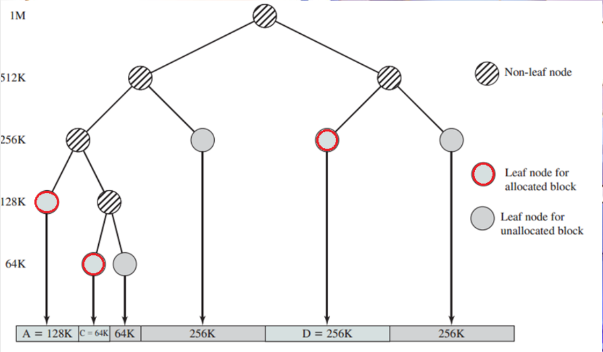
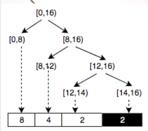

## 一、实验目的

- 理解页表的建立和使用方法
- 理解物理内存的管理方法
- 理解页面分配算法

​	实验一过后我们做出来了一个可以启动的系统，实验二主要涉及操作系统的物理内存管理。操作系统为了使

用内存，还需高效地管理内存资源。本次实验我们会了解如何发现系统中的物理内存，然后学习如何建立对

物理内存的初步管理，即了解连续物理内存管理，最后掌握页表相关的操作，即如何建立页表来实现虚拟内

存到物理内存之间的映射，帮助我们对段页式内存管理机制有一个比较全面的了解。本次的实验主要是在实

验一的基础上完成物理内存管理，并建立一个最简单的页表映射。

## 二、实验过程

#### 练习0：填写已有实验

本实验依赖实验1。请把你做的实验1的代码填入本实验中代码中有“LAB1”的注释相应部分并按照实验手册进行进一步的修改。具体来说，就是跟着实验手册的教程一步步做，然后完成教程后继续完成完成exercise部分的剩余练习。(具体过程较为机械，不过多阐述)。

**物理内存分配与回收**：从空闲内存块的链表上查找第一个大小大于所需内存的块，分配出去，回收时会按照地址从小到大的顺序插入链表，并且合并与之相邻且连续的空闲内存块。

**函数部分**：

+ `default_init`：初始化空闲内存块的链表，将空闲块个数设置为0。
  + 初始化`free_list` 以及`nr_free`。

+ `default_init_memmap`：用于初始化一个空闲内存块。先查询空闲内存块的链表，按照地址顺序插入到合适的位置，并将空闲内存块个数加n。
  + 初始化每个页面的属性并将页面引用计数设置为0。
  + 将首个页面的 `property` 设置为块的总数，表示此块中的页面数量。
  + 将这些页面添加到 `free_list` 中，更新 `nr_free`。

+ `default_alloc_pages`：用于分配给定大小的内存块。如果剩余空闲内存块大小多于所需的内存区块大小，则从链表中查找大小超过所需大小的页，并更新该页剩余的大小。
  + 遍历空闲块列表，查找第一个满足请求的块（块大小大于等于 `n`）。
  + 如果找到了合适的块，会将块分割成两部分，一部分用于分配，另一部分保留在列表中。 如果分割后剩余的块大小大于 `n`，则更新剩余块的 `property` 并添加到列表中。
  + 减少 `nr_free` 计数，标记已分配页面。

+ `default_free_pages`：用于释放内存块。将释放的内存块按照顺序插入到空闲内存块的链表中，并合并与之相邻且连续的空闲内存块。
  + 将页面的属性重置，并将页面引用计数设置为0。
  + 将页面添加到空闲块列表中，同时合并相邻的空闲块。
  + 如果释放的页面与前一个页面或后一个页面相邻，会将它们合并为一个更大的空闲块。
  + 更新 `nr_free` 。
  
**改进空间：**

* 我认为内存块合并的策略可以着手优化，并且内存页分配策略也可以优化，选择更高效的分配策略，best-fit就是其中之一


#### 练习2：实现 Best-Fit 连续物理内存分配算法（需要编程）
在完成练习一后，参考kern/mm/default_pmm.c对First Fit算法的实现，编程实现Best Fit页面分配算法，算法的时空复杂度不做要求，能通过测试即可。
请在实验报告中简要说明你的设计实现过程，阐述代码是如何对物理内存进行分配和释放，并回答如下问题：
- 你的 Best-Fit 算法是否有进一步的改进空间？

**设计实现过程**：bestfit和firstfit的区别在于firstfit是找到满足条件的区间后直接返回，但是bestfit会找到最合适的（这里是最小的）空闲块后返回。查找策略是按照顺序，遇到第一块比所需内存块大的空闲内存块时，先将该块分配给`page`，之后继续查询，如果查询到大小比分配的内存块小的空闲内存块，将`page`更新为当前的内存块。释放内存块时，按照顺序将其插入链表中，并合并与之相邻且连续的空闲内存块。
判断逻辑的实现如下：

```c
size_t min_property = nr_free + 1;
while ((le = list_next(le)) != &free_list) {
    struct Page *p = le2page(le, page_link);
    if (p->property >= n && p->property < min_property) {
        page = p;
        min_property = p->property;
    }
}
```

#### 扩展练习Challenge：buddy system（伙伴系统）分配算法（需要编程）

Buddy System算法把系统中的可用存储空间划分为存储块(Block)来进行管理, 每个存储块的大小必须是2的n次幂(Pow(2, n)), 即1, 2, 4, 8, 16, 32, 64, 128...

 -  参考[伙伴分配器的一个极简实现](http://coolshell.cn/articles/10427.html)， 在ucore中实现buddy system分配算法，要求有比较充分的测试用例说明实现的正确性，需要有设计文档。
-  
### 扩展练习Challenge：buddy system（伙伴系统）分配算法（需要编程）
#### 算法原理阐述：

* 初始化
在 Buddy System 中，空间块之间的关系形成一颗完全二叉树，对于一颗有着n叶子的完全二叉树来说，所有节点的总数为2n约等于2n-1 。也就是说，如果 Buddy System 的可分配空间为n页的话，那么就需要额外保存 2n-1 个节点信息。

* 初始化空闲链表:Buddy System 并不需要链表，但是为了在调式的时候方便访问所有空闲空间，还是将所有的空闲空间加入链表中。

* 确定分配空间大小:假设我们得到了大小为n的空间，我们需要在此基础上建立 Buddy System，经过初始化后，Buddy System 管理的页数为2^m，那么大小为 n 的实际空间可能分为两个或者三个部分。

* 节点信息区：节点信息区可以用来保存每个节点对应子树中可用空间的信息，用于在分配内存的时候便于检查子树中是否有足够的空间来满足请求大小。在 32 位操作系统中，最大页数不会超过 4GB/4KB=1M，所有使用一个 32 位整数即可表示每个节点的信息。所以节点信息区的大小为 2^m *2 *4字节，每页大小为 4KB，内存占用按照页面大小对齐，所以占用max{1,2^m-9}页。

* 虚拟分配区：占用2^m页。

* 实际分配区：显然实际可以得到的内存大小不大可能刚好等于节点信息区大小+分配空间区大小。如果节点信息区大小+分配空间区大小<=内存大小，那么实际可以分配的区域就等于  页。如果节点信息区大小+分配空间区大小>内存大小，那么实际可以分配的区域就等于2^m页。作为操作系统，自然希望实际使用的区域越大越好，不妨分类讨论。
  
  1.当内存小于等于512页：此时无论如何节点信息都会占用一页，所以提高内存利率的方法就是将实际内存大小减一后向上取整（文中整数意为2的幂）。

  2.当内存大于512页：不难证明，对于内存大小n来说，最佳虚拟分配区大小往往是n向下取整或者向上取整的数值，所以候选项也就是只有两个，所以可以先考虑向下取整。对于[2^m,2^(m+1)-1]中的数 n，向下取整可以得到2^m:

      ·当n<=2^(m-9)+2^m时，显然已经是最佳值；
      ·当2^(m-9)+2^m< n< 2^(m-8)+2^m时，扩大虚拟分配区导致节点信息区增加却没有使得实际分配区增加，所以当期 m 还是最佳值；
      ·当n>2^(m-8)+2^m时， 可以扩大实际分配区。
* 初始化节点信息:虚拟分配区可能会大于实际分配区，所以一开始需要将虚拟分配区中没有实际分配区对应的空间标记为已经分配进行屏蔽。另当前区块的虚拟空间大小为 ，实际空间大小为 ，屏蔽的过程如下：
  
      ·如果v=r，将空间初始化为一个空闲空间，屏蔽过程结束；
      ·如果r=0，将空间初始化为一个已分配空间，屏蔽过程结束；
      ·如果r<=v/2，将右半空间初始化为已分配空间，更新  后继续对左半空间进行操作；
      ·如果r>=v/2，将左半空间初始化为空闲空间，更新  后继续对左半空间进行操作。
      以虚拟分配区 16 页、实际分配区 14 页为例，初始化后如下：

* 分配过程:Buddy System 要求分配空间为 2 的幂，所以首先将请求的页数向上对齐到 2​ 的幂。接下来从二叉树的根节点（1号节点）开始查找满足要求的节点。对于每次检查的节点： 

      ·如果子树的最大可用空间小于请求空间，那么分配失败；
      ·如果子树的最大可用空间大于等于请求空间，并且总空间大小等于请求空间，说明这个节点对应的空间没有被分割和分配，并且满足请求空间大小，那么分配这个空间；
      ·如果子树的最大可用空间大于等于请求空间，并且总空间大小大于请求空间，那么在这个节点的子树中查找：
  如果这个节点对应的空间没有被分割过（最大可用空间等于总空间大小），那么分割空间，在左子树（左半部分）继续查找；

      ·如果左子树包含大小等于请求空间的可用空间，那么在左子树中继续查找；
      ·如果右子树包含大小等于请求空间的可用空间，那么在右子树中继续查找；
      ·如果左子树的最大可用空间大于等于请求空间，那么在左子树中继续查找；
      ·如果右子树的最大可用空间大于等于请求空间，那么在右子树中继续查找。

  当一个空间被分配之后，这个空间对应节点的所有父节点的可用空间表都会受到影响，需要自地向上重新更新可用空间信息。

* 释放过程：Buddy System 要求分配空间为 2 的幂，所以同样首先将请求的页数向上对齐到2的幂。在进行释放之前，需要确定要释放的空间对应的节点，然后将空间标记为可用。接下来进行自底向上的操作：如果某节点的两个子节点对应的空间都未分割和分配，那么合并这两个空间，形成一个更大的空间，否则，根据子节点的可用空间信息更新父节点的可用空间信息。
 
#### 扩展练习Challenge：任意大小的内存单元slub分配算法（需要编程）

slub算法，实现两层架构的高效内存单元分配，第一层是基于页大小的内存分配，第二层是在第一层基础上实现基于任意大小的内存分配。可简化实现，能够体现其主体思想即可。

 - 参考[linux的slub分配算法/](http://www.ibm.com/developerworks/cn/linux/l-cn-slub/)，在ucore中实现slub分配算法。要求有比较充分的测试用例说明实现的正确性，需要有设计文档。

尝试过，但是一直未能成功运行。

整体思路为首先实现第一层（页级内存管理），实现对固定大小内存页的分配和释放。
和前面类似使用
**slub_init**：初始化页级内存管理器，将 `free_list` 链表置空并将可用页数 `nr_free` 设置为 0。

 **slub_init_memmap**：初始化内存映射，主要将从 `base` 开始的 `n` 个 `Page` 页（模拟物理页结构）加入 `free_list` 中。 通过循环清空每个页的标志位 `flags` 和 `property`，并重置引用计数 `page_ref`。 将 `base` 页的 `property` 设置为页数 `n` 并加入 `free_list`，同时更新空闲页数 `nr_free`。

**slub_alloc_pages**：从 `free_list` 中分配指定数量的页。
遍历 `free_list`，寻找 `property` 大于或等于请求页数 `n` 的页。若找到合适的页块，将其从链表中删除并更新剩余页信息。如果页块大小超过请求的 `n` 页，则将剩余部分重新插入 `free_list`。成功分配后返回页地址，否则返回 `NULL`。

**slub_free_pages**：将释放的页重新插入 `free_list`，以便后续分配。
清空每个页的标志位和引用计数。将 `base` 页的 `property` 设置为 `n`，并更新 `nr_free`。遍历 `free_list`，按地址大小将 `base` 插入链表合适位置，以保持链表有序。

之后完成第二部分设计这一部分的设计目的是在分配比页更小的对象时提高内存利用率，并避免频繁分配整页。

**slub_cache_t**：定义一个 SLUB 缓存结构，包含：`obj_size`：对象的大小，经过对齐处理。free_objects`：链表存放空闲对象。

**create_slub_cache**：创建并初始化 SLUB 缓存结构。对象大小 `obj_size` 会对齐到 8 字节，以便在不同架构上优化内存访问。将 `free_objects` 链表初始化为空。

**slub_alloc_object**：从缓存中分配一个对象。如果 `free_objects` 中有可用对象，直接返回首个空闲对象。如果没有可用对象，调用 `slub_alloc_pages` 分配一个整页，然后将页内按 `obj_size` 大小分成小块，将每个小块作为对象添加到 `free_objects`。最终返回一个对象。

**slub_free_object**：释放对象并将其重新放入 `free_objects` 中。

最后进行检测。


#### 扩展练习Challenge：硬件的可用物理内存范围的获取方法（思考题）
  - 如果 OS 无法提前知道当前硬件的可用物理内存范围，请问你有何办法让 OS 获取可用物理内存范围？


> Challenges是选做，完成Challenge的同学可单独提交Challenge。完成得好的同学可获得最终考试成绩的加分。