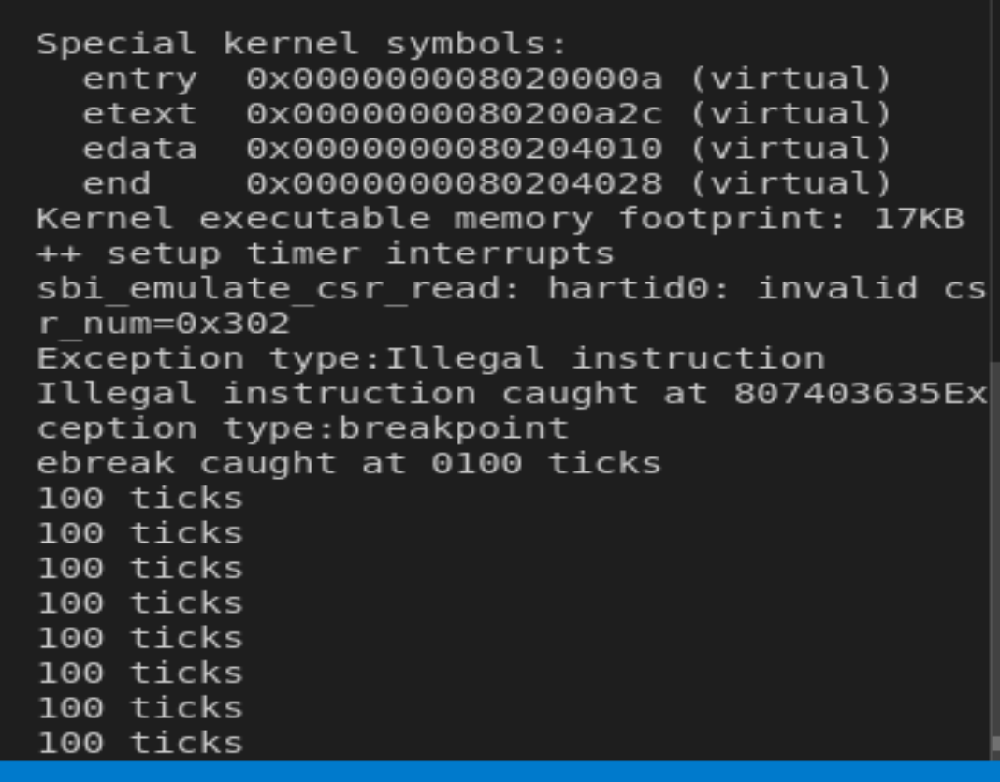
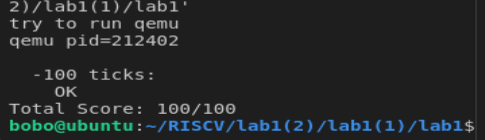

# lab1实验报告
## 练习1：理解内核启动中的程序入口操作
* la sp, bootstacktop：
  
  将bootstacktop地址赋值给sp，bootstacktop代表栈顶地址，这句话的目标是初始化栈空间
* tail kern_init：
  
  尾调用，更新寄存器 ra，跳转执行函数kern_init，kern_init 函数执行完毕时程序不会返回到 tail 指令之后，继续执行其他指令，查看 kern/init/entry.S代码发现，kern_init实现了初始化数据段、时钟、中断描述符表，并且输出内核信息的功能，因此这一步目标也即调用操作系统初始化的函数。
---
## 练习2：完善中断处理
以下是针对要求实现的代码
```
clock_set_next_event();
ticks+=1;
if(ticks==100){
	num+=1;
	print_ticks();
	ticks=0;
	if(num==10){
		sbi_shutdown();
	}
}
```
* 实现流程：在trap.c文件中interrupt_handler函数的switch_case添加时钟中断处理代码，首先调用clock.h中的函数clock_set_next_event，在clock文件中定义了timebase，也就是每次终端的时间，因此这句代码设置了下次终端的时间，余下代码就是按照要求改变tick与num值，在对应条件下print，最后，在num==10的时候调用sbi_shutdown()函数关闭操作系统
---
## 扩展练习 Challenge1：描述与理解中断流程
* ucore中处理中断异常流程：

	&emsp;&emsp;中断是软硬件协同共同完成的，在RISCV中中断被触发时，中断的相关信息(sepc、scause、stval)会被程序自动设置到叫做stvec（中断向量表基址）的CSR当中，中断向量表的作用就是把不同种类的中断映射到对应的中断处理程序，只要把中断处理程序地址保存在stvec中即可，之后CPU会跳到stvec指向的地址，由于内核初始化时将该寄存器设置为__alltraps，也就是跳转到__alltraps，该函数首先执行SAVE_ALL，也就是压栈，保存所有寄存器状态，mov a0,sp将sp保存到a0中，传参到trap函数再执行具体的中断处理函数，在这个函数中会判断终端类型，执行完一系列流程后返回__alltraps重新加载寄存器
* mov a0，sp的目的：
  
  &emsp;&emsp;trap函数接受struct trapframe类型的指针参数，在SAVE_ALL函数当中保存了寄存器状态，同时也读取了存储在CSR中各项中断信息，这也就是trapframe结构体中各个变量的值，sp指向的就是指向这个结构体的地址，因此需要将sp作为参数传入trap函数当中
* SAVE_ALL中寄寄存器保存在栈中的位置确定：
  
  &emsp;&emsp;tarp.h中定义了pushregs与trapframe结构体，其中定义了各个寄存器的顺序与名称
* __alltraps 中是否需要保存所有寄存器：
  
  &emsp;&emsp;需要，因为寄存器就是定义结构体的值，需要全部定义
---
## 扩展练习2：理解上下文切换机制
* csrw sscratch, sp；csrrw s0, sscratch, x0：
  
  &emsp;&emsp;第一句将sp的值赋值给sscratch，第二句将sscratch赋值给s0，将sscratch置0，将sp值存入s0当中，后续按照定义在trapframe中的顺序储存到栈当中，同时将sscratch置0，如果产生了递归异常，异常向量就会知道它来自于内核
* 保存了stval scause这些csr，而在restore all里面却不还原，store的意义：
  
  &emsp;&emsp;scause 和 stval，因为这些寄存器的内容仅对异常处理代码有用，在异常处理完成后，系统将继续执行其他任务，而这些任务不需要知道之前的异常详情。
---
## 扩展练习Challenge3：完善异常中断
根据trapframe结构体的定义，编写两种异常处理代码如下：
```
case CAUSE_ILLEGAL_INSTRUCTION:
    cprintf("Exception type:Illegal instruction\n");
    cprintf("Illegal instruction caught at 0x%08x\n", tf->epc);
    tf->epc += 4; 
    break;
case CAUSE_BREAKPOINT:
    cprintf("Exception type: breakpoint\n");
    cprintf("ebreak caught at 0x%08x\n", tf->epc);
    tf->epc += 2; 
    break;
```
在kern_init函数中intr_enable();的作用是中断初始化，因此写入以下代码分别触发两种异常
```
asm("mret");
asm("ebreak");
```
### 运行之后的输出如下：


---
## 测试
运行make grade输出：

